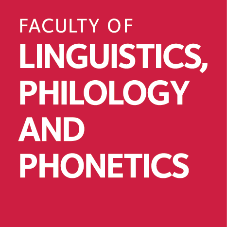

<!-- README.md is generated from README.Rmd. Please edit that file -->

```{r, include = FALSE}
knitr::opts_chunk$set(
  collapse = TRUE,
  comment = "#>"
)
```

# Kähler's (1987) Indonesian Translation To Check

<!-- badges: start -->
[{width="84"}](https://www.ox.ac.uk/) [{width="83"}](https://www.ling-phil.ox.ac.uk/) [{width="325"}](https://www.ukri.org/councils/ahrc/) </br>*This work is part of the [AHRC-funded project](https://app.dimensions.ai/details/grant/grant.12915105) on the lexical resources for Enggano, led by the Faculty of Linguistics, Philology and Phonetics at the University of Oxford, UK. Visit the [central webpage of the Enggano project](https://enggano.ling-phil.ox.ac.uk/)*.
<p xmlns:cc="http://creativecommons.org/ns#" >This work is licensed under <a href="https://creativecommons.org/licenses/by-nc-sa/4.0/?ref=chooser-v1" target="_blank" rel="license noopener noreferrer" style="display:inline-block;">CC BY-NC-SA 4.0 </a></p>
<!-- badges: end -->

## Description

This repository tracks the changes in the manual checking of the Indonesian translation of the Enggano-German dictionary by Hans Kähler [-@kähler1987]. The Indonesian translation was produced using the `deeplr` R package [@deeplr2023] from the English translation of the German gloss.

The data in this repository is still partial and the main data will be available in the main repository [here](https://github.com/engganolang/kahler-1987).

## References
